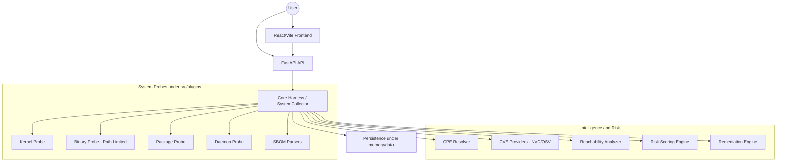

# SBOM Manager - Exploit Surface Analyzer

## Vision
A security-oriented orchestration framework that transforms passive SBOM collection into active exploit-surface analysis. The system correlates kernel state, binary mitigations, package vulnerabilities, daemon exposure, and runtime reachability to identify realistic attack paths.

## Architecture

## Core Principles
- **Correlation over Collection**: Assets should be linked into attack-surface relationships, not treated as isolated inventory rows.
- **Exploitability Focus**: Risk reflects reachability, exposure, and mitigations such as PIE, NX, RELRO, KASLR, SMEP, and SMAP.
- **User-Defined Scope**: Binary scanning is limited to user-specified paths to prevent system-wide lag.
- **Graceful Degradation**: The system functions for non-root users but marks restricted data explicitly.

## Asset Categories & Analysis
- **Kernel**: Version, release, config, and mitigations.
- **Binaries**: Path-limited ELF analysis, NX, PIE, RELRO, setuid/setgid, hashes, and permissions.
- **Packages**: Package manifests, PURL/CPE mapping, OSV/NVD enrichment, and runtime usage.
- **Daemons**: Port to PID to binary mapping and exposure context.
- **SBOM/Third Party**: CycloneDX/SPDX parsing, proprietary blobs, vendor signatures, and provenance.

## Technical Stack
- **Backend/Core**: Python 3.10+, FastAPI, Uvicorn, Pydantic.
- **Probes/Intelligence**: `requests`, `python-dotenv`, `aiohttp`, `pyelftools`, `psutil`, `loguru`, `msgpack`.
- **Verification**: Pytest, HTTPX, scripts under `scripts/`, and benchmarks under `evaluations/benchmarks/`.
- **Frontend**: React, Vite, Tailwind CSS.

## Coordination & Governance
- **Primary instructions**: Root `AGENTS.md`.
- **Compatibility pointer**: Root `CLAUDE.md` points back to `AGENTS.md`.
- **Domain execution**: Current domain notes live under paths such as `src/plugins/*/CLAUDE.md`, `src/core/CLAUDE.md`, `src/core/graph/CLAUDE.md`, `src/api/CLAUDE.md`, `src/web/CLAUDE.md`, and `evaluations/benchmarks/CLAUDE.md`.
- **Workflow**: Root instructions coordinate; domain notes guide local execution; session logs and progress files record work.

## Repository Layout Note
This repository follows a harness-engineering layout: `docs/` for architecture and decisions, `skills/` for reusable workflows, `plans/` and `tasks/` for execution tracking, `scripts/` for repeatable commands, `evaluations/` for benchmarks and reports, `memory/` for project context and local caches, and `src/` for runnable code.
