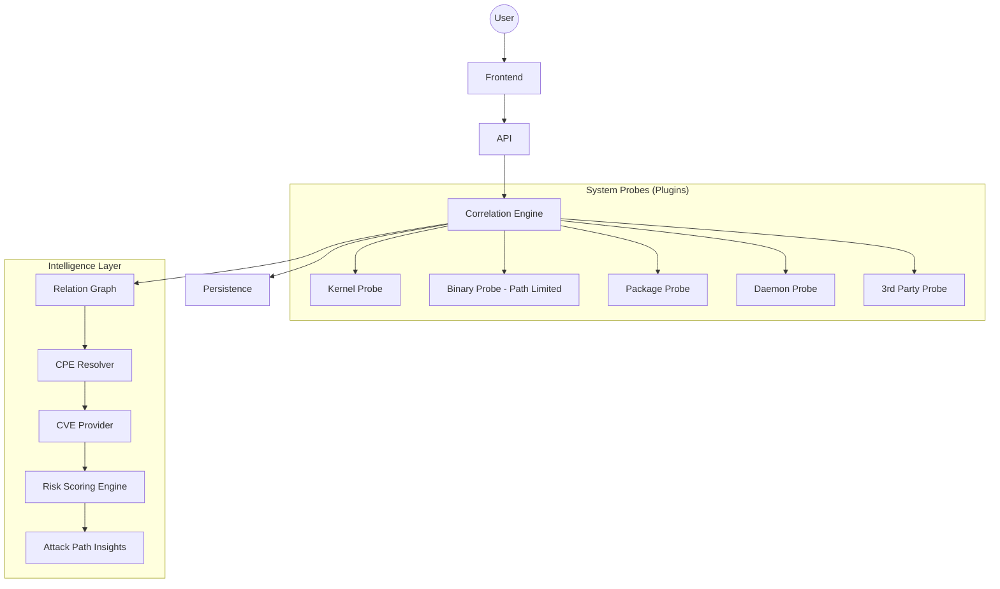

# SBOM Manager - Exploit Surface Analyzer

## Vision
A security-oriented orchestration framework that transforms passive SBOM collection into active attack surface analysis. The system correlates kernel state, binary mitigations, package vulnerabilities, and daemon exposure to identify real, reachable attack paths.

## Architecture

## Core Principles
- **Correlation over Collection**: Assets are nodes in a graph, not entries in a list.
- **Exploitability Focus**: Focus on mitigations (PIE, NX) and reachability, not just CVE existence.
- **User-Defined Scope**: Binary scanning is limited to user-specified paths to prevent system lag.
- **Graceful Degradation**: The system functions for non-root users but marks restricted data as `PRIVILEGE_RESTRICTED`.

## Asset Categories & Analysis
- **Kernel**: Version, Config, Mitigations (KASLR, SMEP, SMAP).
- **Binaries**: Path-limited scan, ELF Analysis (NX, PIE, RELRO), setuid/setgid.
- **Packages**: Transitive dependency graphs, OSV/NVD mapping, runtime usage.
- **Daemons**: Port $\rightarrow$ PID $\rightarrow$ Binary mapping, External exposure.
- **3rd Party**: Proprietary blobs, vendor signatures, provenance.

## Technical Stack
- **Core**: Python 3.10+, Pydantic, Loguru, Pytest, `requests`, `python-dotenv`.
- **Analysis**: `pyelftools` (ELF), `psutil` (Processes/Net), `networkx` (Graph).
- **API/Web**: FastAPI, React, Tailwind CSS.

## Coordination & Governance
- **Global Coordination**: Root `CLAUDE.md`.
- **Domain Execution**: Each plugin directory (`plugins/*`) and `core/graph` has its own `CLAUDE.md` and task tracking.
- **Workflow**: Root coordinates $\rightarrow$ Domain executes $\rightarrow$ Domain logs $\rightarrow$ Root synchronizes.

## Repository Layout Note
This repository follows a harness-engineering layout: docs/ for architecture and decisions, skills/ for reusable domain workflows, plans/ and tasks/ for execution tracking, scripts/ for repeatable commands, evaluations/ for evaluations/benchmarks/reports, memory/ for project context and local caches, and src/ for runnable code.
