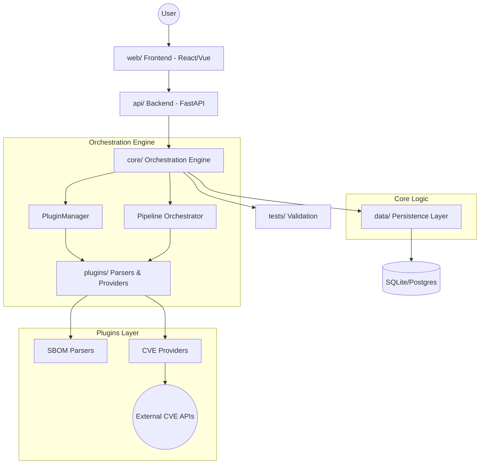

# SBOM Manager - Orchestration & Harness Engineering

## Vision
A pluggable Python-based orchestration framework for SBOM ingestion and CVE mapping, providing a high-density, filterable dashboard. The system focuses on risk-aware asset management, tracking software components across different categories (Packages, Binaries, Daemons, 3rd Party) and their associated system-level risks (Paths, Permissions/setuid, and User-defined remediation status).

## Architecture

- `core/`: Orchestration engine, plugin manager, and pipeline.
- `plugins/`: Pluggable SBOM parsers and CVE providers.
- `api/`: FastAPI backend.
- `web/`: React/Vue frontend (Elastic UI style).
- `data/`: Data persistence and schema.
- `tests/`: Integration and unit tests.

## Coordination & Governance
- **Global Coordination**: This root `CLAUDE.md` serves as the project's central coordinator.
- **Distributed Tracking**: Each domain directory maintains its own:
    - `CLAUDE.md`: Domain-specific requirements and task list.
    - `progress.json`: Machine-readable state of tasks.
    - `session_log.md`: Human-readable chronological record of agent actions and decisions.
- **Workflow**: Root coordinates $\rightarrow$ Domain executes $\rightarrow$ Domain logs $\rightarrow$ Root synchronizes.

## Tech Stack
- **Core**: Python 3.10+, Pydantic, Loguru, Pytest
- **Plugins**: cyclonedx-python-lib, python-nvdlib, psutil, pycryptodome
- **API**: FastAPI, Uvicorn, SQLAlchemy 2.0
- **Data**: PostgreSQL (Prod), SQLite (Dev), Redis (Caching)
- **Web**: React, Tailwind CSS, TanStack Table, Zustand, Lucide React
