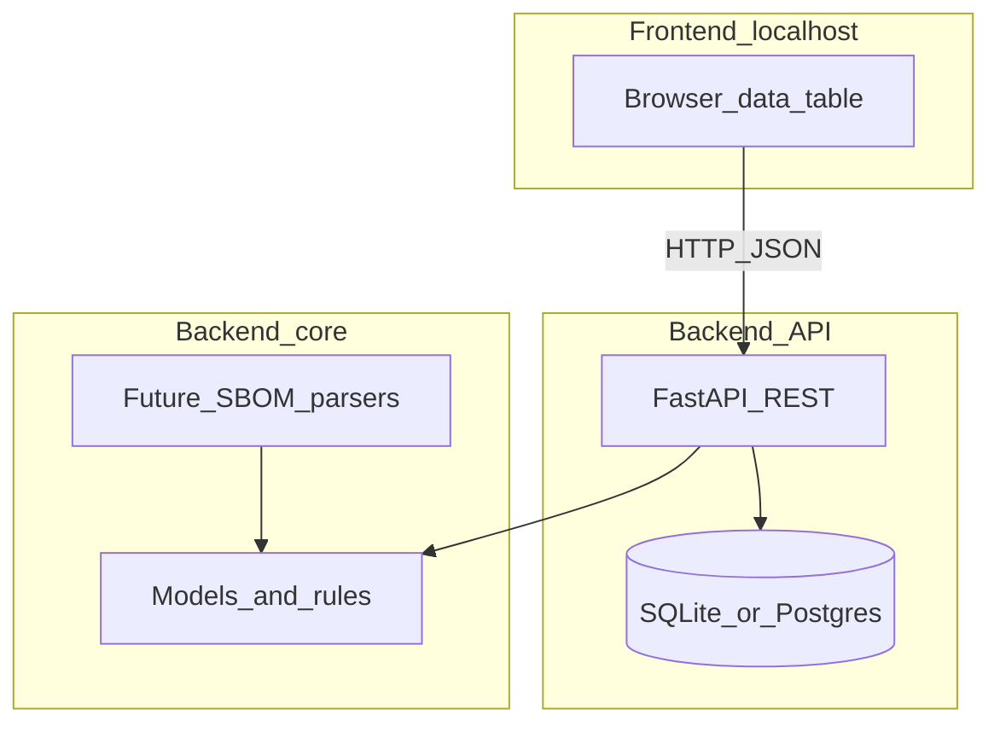

# sbomManager — implementation plan

## Product description

**sbomManager** surfaces SBOM (Software Bill of Materials) information in a structured way: a formal, machine-readable inventory of components, libraries, and modules in an application — presented through a **web UI** users open in a browser on **localhost** (Linux dev environment).

## Goal

- Deliver a **working UI** backed by Python services that displays SBOM-related component data in a **data table**.

## Feature: data table columns`/home/dian/.cursor/plans/sbom_manager_project_a5e19c8c.plan.md`

Each row represents one component (or one view of a component) with at least these fields:

| Column            | Meaning (default interpretation for MVP)                                                                        |
| ----------------- | --------------------------------------------------------------------------------------------------------------- |
| **Name**          | Component or package name                                                                                       |
| **Version**       | Resolved version string                                                                                         |
| **Path**          | Path in tree, file path, or locator string (e.g. lockfile path)                                                 |
| **time**          | Timestamp — default to *ingested/observed time* unless you later standardize on *build time* from SBOM metadata |
| **handle**        | Stable identifier — e.g. PURL, CPE, or internal UUID (document format in API schema)                            |
| **vendor**        | Supplier / author / organization                                                                                |
| **license**       | SPDX expression or declared license string                                                                      |
| **hash (sha256)** | SHA-256 of artifact or SBOM fragment (hex string)                                                               |
| **dependency**    | Relationship to parent/other components — MVP: parent id, depends-on list, or JSON blob                         |
| **rule**          | Policy outcome — e.g. allow / deny / needs_review / unknown (string or enum)                                    |

*Open refinement (can be adjusted without changing the column list): exact semantics of **handle**, **dependency**, and **rule** when real SPDX/CycloneDX ingest lands.*

## Constraints

| Constraint                 | Plan                                                                                                                                                                                                                                                                                                                                                                                                             |
| -------------------------- | ---------------------------------------------------------------------------------------------------------------------------------------------------------------------------------------------------------------------------------------------------------------------------------------------------------------------------------------------------------------------------------------------------------------- |
| **Environment**            | Linux-first paths, scripts, and docs (`#!/usr/bin/env`, line endings, no Windows-only assumptions).                                                                                                                                                                                                                                                                                                              |
| **Language**               | **Python** for backends and tooling; frontend may be JS/TS for the browser (see below).                                                                                                                                                                                                                                                                                                                          |
| **Roles: 1 front, 2 back** | **Architecture mapping** (recommended for the codebase): **one frontend app** + **two backend parts** in one monorepo: (1) **API service** — HTTP/JSON, persistence, validation; (2) **core/ingest library** — domain models, normalization, future SPDX/CycloneDX parsing, shared by API and scripts. *If you meant team roles instead of architecture, the same split still maps cleanly to responsibilities.* |

## “Two backends” layout (concrete)

- `**backend-core**` (package): Pydantic models, enums (`Rule`), hashing helpers, dummy-data factories, future CycloneDX/SPDX adapters.
- `**backend-api**` (package): FastAPI app, routes, DB session, depends on `backend-core`.
- `**frontend**`: SPA or server-rendered UI (see recommendation) talking to the API on localhost.

## Pre-project tools (before full feature work)

Per your requirements:

### 1. Dummy data + self-test

- `**backend-core**`: factory functions (e.g. Faker or fixed seeds) that produce **lists of dicts/Pydantic models** matching the table columns.
- **Seed endpoint or CLI**: e.g. `python -m sbom_manager.seed --rows 100` or `POST /dev/seed` (guarded in dev only).
- **Tests**:
  - **pytest** + **httpx** `AsyncClient`: `GET /api/components` returns 200, correct JSON shape, pagination.
  - Optional: Playwright smoke test “table renders N rows” (only if SPA chosen).

### 2. Recommendations (stack)

| Layer                     | Recommendation                                                     | Rationale                                                                                                              |
| ------------------------- | ------------------------------------------------------------------ | ---------------------------------------------------------------------------------------------------------------------- |
| **Python packaging**      | **uv** (or Poetry)                                                 | Reproducible lockfiles, fast on Linux.                                                                                 |
| **API**                   | **FastAPI** + **Uvicorn**                                          | Async, OpenAPI docs at `/docs`, good for JSON tables.                                                                  |
| **Data layer**            | **SQLAlchemy 2** + **SQLite** (dev) / **Postgres** (optional prod) | Fits relational rows; easy localhost.                                                                                  |
| **Validation**            | **Pydantic v2**                                                    | Shared models between API and core.                                                                                    |
| **Frontend**              | **React + Vite + TypeScript** (or **TanStack Table**)              | Many columns benefit from sticky headers, sorting, filtering; runs on localhost with Vite dev server proxy to FastAPI. |
| **Alternative UI**        | **Jinja2 + HTMX**                                                  | All-server-driven HTML, fewer moving parts if you want zero TS — still works in browser on localhost.                  |
| **Default for this plan** | **React + Vite + FastAPI**                                         | Better fit for dense SBOM tables unless you explicitly prefer HTMX.                                                    |
| **Real SBOM later**       | `cyclonedx-python-lib`, `spdx-tools`                               | When replacing dummy data.                                                                                             |

**Localhost workflow**: run API (`uvicorn`) on e.g. `127.0.0.1:8000`, frontend dev server on `5173` with proxy to API, open `http://localhost:5173` in the browser.

## Implementation phases

1. **Tooling & dummy data** — schema, factories, seed, pytest for API contract.
2. **Scaffold** — monorepo folders, `pyproject.toml`, optional `docker-compose` for Postgres only if needed.
3. **Backend API** — CRUD/list for components; filter query params; OpenAPI.
4. **Frontend** — table page wired to API; loading/error states.
5. **Later** — file upload, CycloneDX/SPDX ingest, vulnerability enrichment.

## Success criteria (MVP)

- On Linux: documented commands start API + UI; browser shows a **sortable/filterable** table with all listed columns populated from dummy data.
- Automated test proves API returns stable shape and non-empty seeded data.

## Out of scope for first delivery

- Production auth, multi-tenant hosting, full compliance reporting (unless you add later).

