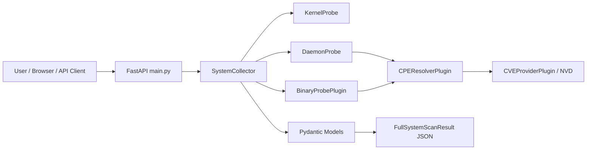

# Final Presentation - SBOM Manager / Exploit Surface Analyzer

## Slide 1. Problem & Motivation

### Problem
- 일반적인 SBOM은 패키지 목록을 제공하지만, 실제 시스템에서 어떤 서비스와 바이너리가 노출되어 있는지까지 연결하기 어렵다.
- 보안 담당자는 커널, 데몬, 바이너리, 패키지, CVE 정보를 각각 다른 도구로 확인해야 하므로 분석 시간이 길고 누락 위험이 있다.
- 단순 취약점 목록만으로는 "외부에 노출된 서비스가 실제로 어떤 취약한 바이너리와 연결되는가"를 판단하기 어렵다.

### User Story
> As a security analyst, I want to automatically map running services, binaries, kernel state, and vulnerabilities,  
> so that I can prioritize real exploit surfaces instead of reviewing isolated SBOM entries.

### Motivation
- SBOM 데이터를 실제 실행 환경과 연결하여 보안 분석의 실효성을 높인다.
- 수동 점검을 줄이고, 반복 가능한 스캔 및 취약점 매핑 흐름을 제공한다.
- 향후 패키지 SBOM, CPE, CVE, exploit 정보를 통합하는 기반을 만든다.

### 발표 시 보여줄 Evidence
- `sbom_manager_project_a5e19c8c.plan.md`: 초기 문제 정의 및 목표
- `tests/test_design.md`: Exploit Surface Analyzer 설계 방향

### 발표 멘트
이 프로젝트는 단순히 SBOM 표를 보여주는 것에서 출발했지만, 구현 과정에서 실제 공격 표면을 분석하는 방향으로 확장되었습니다. 핵심 문제는 "취약한 패키지가 있다"는 정보만으로는 실제 위험도를 판단하기 어렵다는 점입니다.

---

## Slide 2. Project Overview & Goals

### Project Overview
- 프로젝트명: SBOM Manager / Exploit Surface Analyzer
- 목표: Linux 시스템의 실행 자산을 수집하고, CPE/CVE 정보를 연결하여 JSON API로 제공
- 주요 기능:
  - Kernel 보안 설정 및 버전 수집
  - Listening daemon, port, exposure, process owner 분석
  - ELF binary 권한, hash, mitigation 정보 분석
  - CPE resolution 및 CVE mapping
  - FastAPI 기반 `/health`, `/scan` API 제공

### Goals
- 플러그인 기반 구조로 분석 기능을 분리한다.
- Core collector가 여러 probe를 비동기적으로 실행한다.
- 결과를 Pydantic 모델로 표준화하여 API 응답으로 제공한다.
- root 권한이 없어도 graceful degradation 방식으로 동작한다.

### Architecture


### 발표 시 보여줄 Evidence
- `main.py`: FastAPI endpoint
- `core/collector.py`: 비동기 수집 orchestration
- `core/models.py`: API 응답 모델

### 발표 멘트
전체 구조는 API, Core Collector, Plugin Layer로 나누었습니다. API는 외부 요청을 받고, Collector는 kernel, daemon, binary probe를 병렬로 실행한 뒤 CPE와 CVE 정보를 붙여 표준 JSON으로 반환합니다.

---

## Slide 3. Repository Structure

### Repository Organization
```text
sbomManager/
├── api/                         # API 관련 세션/진행 문서
├── core/                        # 핵심 모델, collector, pipeline, plugin manager
│   ├── base.py
│   ├── collector.py
│   ├── models.py
│   ├── pipeline.py
│   └── IMPLEMENTATION.md
├── plugins/                     # 기능별 분석 플러그인
│   ├── binaries/
│   ├── daemons/
│   ├── intelligence/
│   ├── kernel/
│   └── cyclonedx_parser.py
├── tests/                       # 단위/통합/검증 테스트
├── data/                        # CPE cache 및 테스트 데이터
├── slide/                       # 발표 자료
├── main.py                      # FastAPI entrypoint
├── SESSION_LOG.md               # 전체 개발 기록
└── sbom_manager_project_*.plan.md
```

### Harness Engineering 적용
- 기능별 디렉터리 분리: `core`, `plugins`, `tests`, `data`, `slide`
- 문서와 구현을 함께 관리: `IMPLEMENTATION.md`, `design.md`, `SESSION_LOG.md`
- 플러그인 harness:
  - `BasePlugin` 인터페이스
  - `PluginManager`
  - `PipelineStage`
  - 기능별 probe plugin

### GitHub Repository 활용 시 강조할 점
- 디렉터리 구조가 역할별로 분리되어 있어 협업자가 담당 영역을 이해하기 쉽다.
- 구현 파일과 설계 문서가 같은 모듈 주변에 있어 추적이 쉽다.
- 테스트 파일이 기능별로 분리되어 검증 범위를 설명하기 쉽다.

### 발표 시 보여줄 Evidence
- GitHub repository file tree
- `core/IMPLEMENTATION.md`
- `plugins/kernel/design.md`, `plugins/daemons/design.md`, `plugins/binaries/design.md`

### 발표 멘트
평가 기준에서 repository structure의 배점이 높기 때문에 이 슬라이드에서는 실제 GitHub 파일 트리를 보여주는 것이 중요합니다. 우리 저장소는 기능별 플러그인, core orchestration, tests, slide 자료가 분리되어 있어 구조 자체가 협업 산출물입니다.

---

## Slide 4. Documentation Process

### Documentation Flow
```text
Backlog
  ↓
Requirement
  ↓
Design
  ↓
Implementation
  ↓
Testing
  ↓
Review
  ↓
Session Log
```

### Documentation
- Requirements:
  - `sbom_manager_project_a5e19c8c.plan.md`
  - `plugins/*/design.md`
- Design Documents:
  - `tests/test_design.md`
  - `core/IMPLEMENTATION.md`
- Meeting / Session Notes:
  - `SESSION_LOG.md`
  - `core/SESSION_LOG.md`
  - `plugins/SESSION_LOG.md`
  - `tests/SESSION_LOG.md`
- Progress Tracking:
  - `progress.json`
  - module-level `progress.json`

### Quality Management
- Issue Tracking:
  - 기능별 task breakdown을 design 문서에 기록
  - session log에 해결한 이슈와 다음 milestone 기록
- Pull Request Review:
  - GitHub 사용 시 branch -> PR -> review -> merge 흐름으로 연결 가능
  - 발표에서는 commit history 또는 PR 화면을 evidence로 제시
- Documentation Updates:
  - 구현 완료 후 `SESSION_LOG.md`에 변경 사항 기록
  - 설계 변경 시 모듈별 `design.md`와 implementation 문서 갱신

### Evidence
```text
2026-05-05: DaemonProbe / KernelProbe 구현 및 검증
2026-05-11: Version -> CPE -> CVE flow 구현
2026-05-13: Core orchestration + FastAPI 구현
2026-05-18: Intelligence chain 통합
```

### 발표 시 보여줄 Evidence
- `SESSION_LOG.md` 날짜별 개발 기록
- `plugins/daemons/design.md` user/system/functional requirements
- `core/IMPLEMENTATION.md` implementation status checklist

### 발표 멘트
문서 관리는 이 프로젝트의 핵심 평가 포인트입니다. Backlog에서 시작해 요구사항, 설계, 구현, 테스트, 리뷰, 세션 로그로 이어지는 흐름을 유지했습니다. 단순 README 하나가 아니라, 요구사항, 설계, 구현 상태, 세션 로그가 모듈별로 남아 있어 개발 과정과 의사결정 과정을 추적할 수 있습니다.

---

## Slide 5. Agile Development Process

### Agile Process
```text
Project Backlog
        ↓
 Sprint Planning
        ↓
 Implementation
        ↓
 Testing
        ↓
 Sprint Review
        ↓
 Retrospective
        ↓
 Next Sprint
```

### Sprint 1

#### Goal
프로젝트 구조 및 요구사항 정의

#### Deliverables
- Problem Definition
- Repository Structure
- Core Architecture Design
- Plugin Interface Design

#### Evidence
- `sbom_manager_project_a5e19c8c.plan.md`
- `plugins/*/design.md`
- architecture diagram

### Sprint 2

#### Goal
핵심 기능 구현

#### Deliverables
- Kernel Probe
- Daemon Probe
- Binary Probe
- Plugin Manager
- Pipeline

#### Evidence
- implementation commits
- test files
- session logs

### Sprint 3

#### Goal
통합 및 검증

#### Deliverables
- System Collector
- CPE/CVE Integration
- FastAPI API
- End-to-End Testing

#### Evidence
- integration tests
- demo screenshots
- final session logs

### Agile 적용 방식

#### Backlog Management
Project Backlog에서 기능 요구사항과 이슈를 관리하고, Sprint Planning 단계에서 해당 Sprint의 목표와 작업 범위를 선택했습니다.

#### Iterative Development
한 번에 전체 시스템을 개발하지 않고 설계, 핵심 기능 구현, 통합, 검증 순으로 반복적으로 기능을 추가했습니다.

#### Continuous Documentation
각 Sprint 종료 시 `SESSION_LOG.md`, design 문서, implementation 상태를 갱신했습니다.

#### Continuous Testing
기능 구현 직후 Unit Test와 Integration Test를 수행하여 문제를 조기에 발견했습니다.

#### Continuous Improvement
Sprint Review와 Retrospective에서 테스트 결과와 구현 이슈를 점검하고 다음 Sprint 계획에 반영했습니다.

### 발표 시 보여줄 Evidence
- `SESSION_LOG.md`: sprint별로 대응 가능한 날짜별 기록
- `tests/test_core_integration.py`
- `tests/test_cpe_cve_flow.py`
- `tests/verify_api_recursion.py`

### 발표 멘트
이 프로젝트는 Agile 방식으로 진행하였습니다. 초기 요구사항을 모두 구현하는 방식이 아니라, Sprint 단위로 목표를 설정하고 기능을 점진적으로 추가하였습니다. 각 Sprint 종료 시 설계 문서와 Session Log를 업데이트하고, 테스트를 수행하여 다음 Sprint 계획에 반영하였습니다. 이를 통해 요구사항 변경과 기능 확장에 유연하게 대응할 수 있었습니다.

---

## Slide 6. Test & Evaluation

### Testing Strategy
- Unit Test:
  - `Pipeline`, `PluginManager`, data model 검증
  - 개별 probe의 parsing 및 fallback 동작 확인
- Integration Test:
  - plugin -> pipeline -> mapping result 흐름 검증
  - daemon discovery -> CPE -> CVE flow 검증
- Functional Test:
  - FastAPI `/health` 응답 확인
  - `/scan` 요청으로 full system scan JSON 생성 확인
  - privilege 제한 환경에서도 crash 없이 partial result 반환 확인

### Evaluation
| Test Case | Evidence | Result |
|---|---|---|
| Core pipeline integration | `tests/test_core_integration.py` | Pass |
| Daemon probe verification | `tests/verify_daemons.py` | Pass |
| Kernel probe verification | `tests/verify_kernel.py` | Pass |
| CPE/CVE flow | `tests/test_cpe_cve_flow.py` | Pass / environment dependent |
| FastAPI JSON serialization | `tests/verify_api_recursion.py` | Pass |
| CVSS score handling | `tests/verify_cvss_scores*.py` | Pass |

### Validation
- 목표 기능 달성:
  - Linux system asset discovery
  - CPE/CVE enrichment
  - JSON API response
  - plugin-based architecture
- 남은 개선점:
  - frontend UI는 현재 placeholder 수준
  - live NVD/Shodan/Metasploit 연동은 API key와 network 환경에 영향을 받음
  - package probe 및 full SBOM upload flow는 향후 확장 범위

### 발표 시 보여줄 Evidence
- 테스트 파일 목록
- `pytest` 또는 개별 verify script 실행 화면
- `/health` 및 `/scan` 응답 화면

### 발표 멘트
테스트는 단위 테스트와 통합 테스트를 나누어 구성했습니다. 외부 API를 사용하는 CVE 조회는 환경 의존성이 있으므로, 발표에서는 core integration과 API serialization처럼 재현 가능한 테스트를 중심으로 보여주는 것이 안정적입니다.

---

## Slide 7. Demo Screens

### Demonstration

#### Main Screen - FastAPI Docs
- 실행:
```bash
python main.py
```
- 접속:
```text
http://localhost:8000/docs
```
- 보여줄 항목:
  - `GET /health`
  - `POST /scan`

#### Workflow
```text
User enters binary scan paths
  ↓
POST /scan
  ↓
SystemCollector runs Kernel / Daemon / Binary probes
  ↓
CPE Resolver enriches assets
  ↓
CVE Provider maps vulnerabilities
  ↓
JSON result returns to API client
```

#### Example Request
```json
{
  "binary_scan_paths": ["/bin", "/usr/bin"]
}
```

#### Example Result Structure
```json
{
  "kernel": {
    "version": "...",
    "config": {},
    "is_root": false
  },
  "daemons": [
    {
      "port": 8000,
      "address": "0.0.0.0",
      "exposure": "external",
      "binary_path": "...",
      "cpe": "...",
      "vulnerabilities": []
    }
  ],
  "binaries": [
    {
      "path": "/usr/bin/...",
      "sha256": "...",
      "permissions": "...",
      "mitigations": {},
      "cpe": "...",
      "vulnerabilities": []
    }
  ],
  "timestamp": "..."
}
```

### Demo Evidence
- Screenshot 1: FastAPI Swagger UI
- Screenshot 2: `/scan` request body
- Screenshot 3: JSON response containing `kernel`, `daemons`, `binaries`
- Screenshot 4: terminal test execution result

### 발표 멘트
현재 demo는 별도 프론트엔드 화면보다 FastAPI Swagger UI를 중심으로 보여주는 것이 가장 정확합니다. 사용자는 scan path를 입력하고, 결과로 kernel, daemon, binary, vulnerability 정보가 하나의 JSON 구조로 반환되는 것을 확인할 수 있습니다.

---

## Slide 8. Contributions / Challenges / Lessons Learned

### Team Contributions
| Member | Contribution |
|---|---|
| Member A | Core architecture, pipeline, Pydantic models |
| Member B | Kernel / Daemon / Binary probe implementation |
| Member C | CPE/CVE intelligence, testing, documentation |

> 실제 팀원 이름으로 발표 직전에 교체

### Challenges
- Linux 권한 문제:
  - `/proc`, process, binary metadata 접근은 root 여부에 따라 결과가 달라짐
  - 해결: `PRIVILEGE_RESTRICTED`, `UNKNOWN` 상태로 graceful degradation 적용
- 외부 intelligence 연동:
  - NVD/Shodan/Metasploit API는 rate limit, key, network에 영향을 받음
  - 해결: CPE cache, retry logic, fallback CPE generation 적용
- 기능 통합:
  - kernel, daemon, binary, CVE 데이터를 하나의 모델로 합치는 과정에서 serialization 이슈 발생
  - 해결: Pydantic model과 FastAPI `jsonable_encoder` 사용
- 테스트 환경:
  - 실제 시스템 상태에 따라 daemon/binary 결과가 달라짐
  - 해결: mock test와 verify script를 분리

### Lessons Learned
- 보안 도구는 단순 데이터 수집보다 "데이터 연결 구조"가 중요하다.
- 문서화는 최종 보고서가 아니라 개발 중 의사결정 기록으로 관리해야 한다.
- 플러그인 구조는 기능 확장과 테스트 분리에 효과적이다.
- Agile 방식으로 sprint마다 작은 기능을 완성하고 통합하는 방식이 안정적이었다.

### 발표 시 보여줄 Evidence
- `SESSION_LOG.md`: challenges와 resolved issue
- `core/models.py`: `PrivilegeLevel`, `FullSystemScanResult`
- `core/collector.py`: async orchestration 및 enrichment chain

### 발표 멘트
가장 큰 어려움은 실제 시스템 정보를 다루기 때문에 권한과 환경에 따라 결과가 달라진다는 점이었습니다. 이를 crash로 처리하지 않고 제한된 정보로라도 결과를 반환하도록 설계하면서, 보안 도구에서 안정성과 확장성이 중요하다는 점을 배웠습니다.

---

# 평가 기준 매핑

| 평가 항목 | 슬라이드 | 실제 Evidence |
|---|---:|---|
| Problem & Motivation | 1 | plan 문서, test design |
| Project Overview & Goals | 2 | `main.py`, `core/collector.py`, architecture |
| Repository Structure | 3 | GitHub file tree, module layout |
| Documentation | 4 | `SESSION_LOG.md`, `design.md`, `IMPLEMENTATION.md` |
| Agile Development Process | 5 | sprint 흐름, tests, session log |
| Test & Evaluation | 6 | `tests/`, verify scripts |
| Demo Screens | 7 | FastAPI docs, `/scan` JSON |
| Contributions | 8 | 팀원별 역할 |
| Challenges & Lessons Learned | 8 | resolved issues, model/design choices |

# 발표 준비 체크리스트

- [ ] GitHub repository file tree screenshot 준비
- [ ] `SESSION_LOG.md` 날짜별 기록 screenshot 준비
- [ ] `core/IMPLEMENTATION.md` implementation status screenshot 준비
- [ ] `plugins/*/design.md` requirements screenshot 준비
- [ ] FastAPI `/docs` screenshot 준비
- [ ] `/scan` request/response screenshot 준비
- [ ] 테스트 실행 결과 screenshot 준비
- [ ] Slide 8 팀원 이름과 contribution 실제 내용으로 교체

# 발표 전략

- 기능 설명보다 repository structure와 documentation management를 먼저 강조한다.
- "문서 -> 구현 -> 테스트 -> 로그" 흐름을 반복적으로 보여준다.
- frontend가 완성된 웹 화면이 아니라면 숨기지 말고, 현재 demo 범위는 FastAPI Swagger UI와 JSON response라고 명확히 말한다.
- 외부 API 연동은 환경 의존성이 있으므로, 발표 demo는 `/health`, `/scan`, core integration test처럼 재현 가능한 항목을 우선 사용한다.
